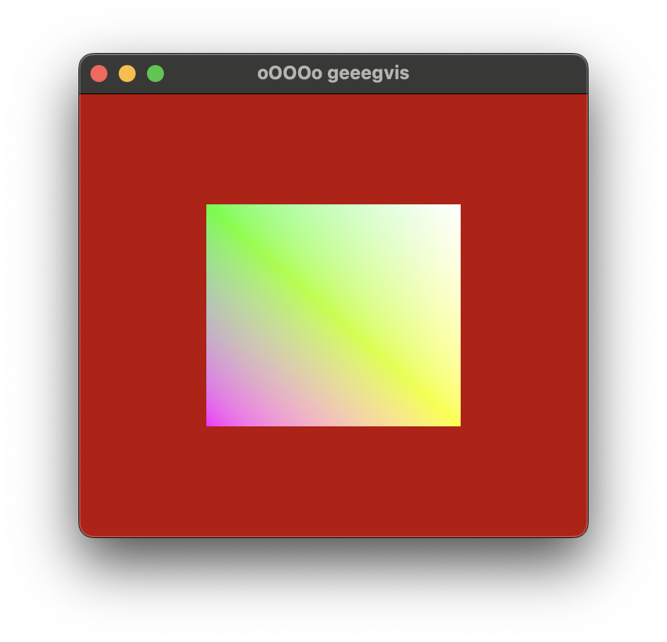

## GVIS engine... or sandbox... or sim... not sure what I'm doing here yet. 
(Gvis pronounced as: a small german child saying geewiz)

Vulkan-based engine project from scratch cause I can. Most of this is based off the vulkan tutorials by khronos cause I actually have no idea what I'm doing. 

I'll keep track of a few small ideas / milestones on this project here and the rest on my little project site: [here](https://quartz.frederich.ca/3D-Graphics-Project)


### Project looks like this guy ---v
```
.
├── Makefile
├── bin
├── build
├── include
├── shaders (for build)
└── src
    ├── fileio
    ├── main.cpp
    ├── platform
    ├── renderer
    │   └── shaders
    └── vulkan
```
Just running one make file rn cause I like the simplicity, but it will def not be lasting long, prolly gonna pivot to `cmake`