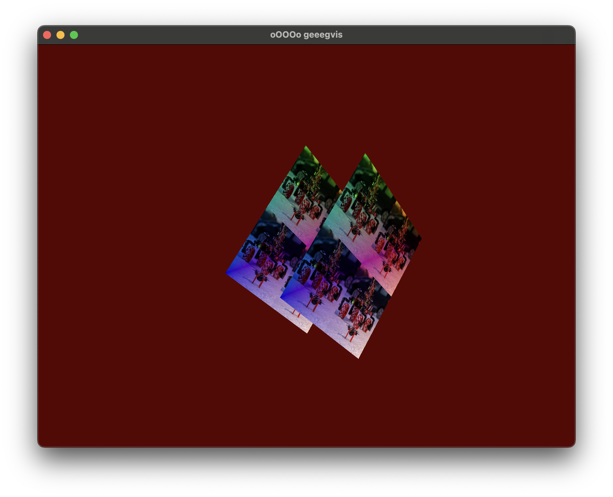

## GVIS engine... or sandbox... or sim... not sure what I'm doing here yet. 
(Gvis pronounced as: a small german child saying geewiz)

Vulkan-based engine project from scratch cause I can. Most of this is based off the vulkan tutorials by khronos cause I actually have no idea what I'm doing. 

I'll keep track of a few small ideas / milestones on this project here and the rest on my little project site: [here](https://quartz.frederich.ca/3D-Graphics-Project)


### Project looks like this guy ⭣
```
.
├── Makefile
├── include [ stb + shared ]
├── shaders [ for build ]
├── src
│   ├── fileio [ file r / w ]
│   ├── main.cpp
│   ├── platform [ using glfw ]
│   ├── renderer
│   │   └── shaders [ shader code + helpers ]
│   ├── textures [ bins ]
│   └── vulkan [ device selection ]
└── textures [ for build ] 
```
Just running one make file rn cause I like the simplicity, but it will def not be lasting long, prolly gonna pivot to `cmake`
```
# this will still update shader code
make build && make run 
<<<<<<< HEAD
# for intellisense
bear --append -- make && make run
```
<<<<<<< HEAD
=======
Just running one make file rn cause I like the simplicity, but it will def not be lasting long, prolly gonna pivot to `cmake`
```
=======
>>>>>>> 70bd5f2 (done with textures and depth buffers)
# for intellisense
bear --append -- make && make run
```
>>>>>>> 1edd621 (readme update)
